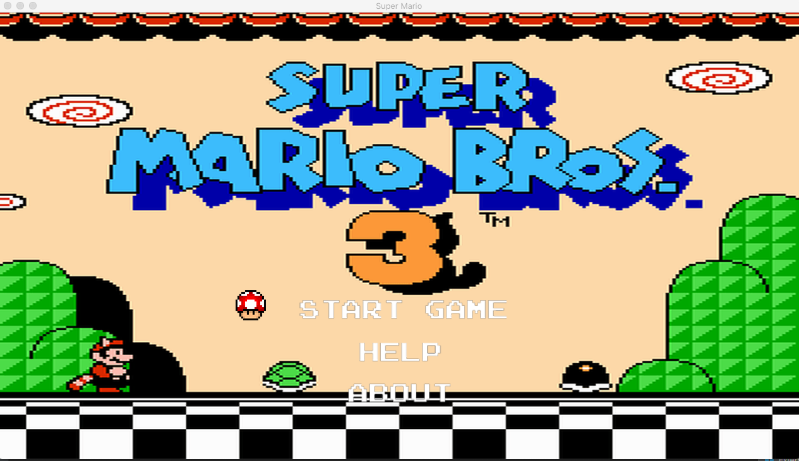
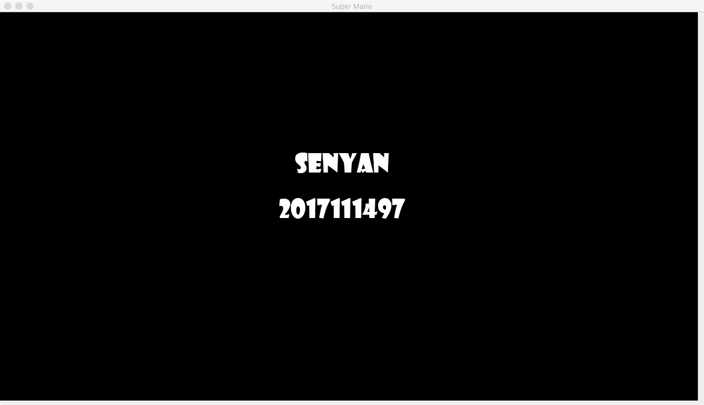
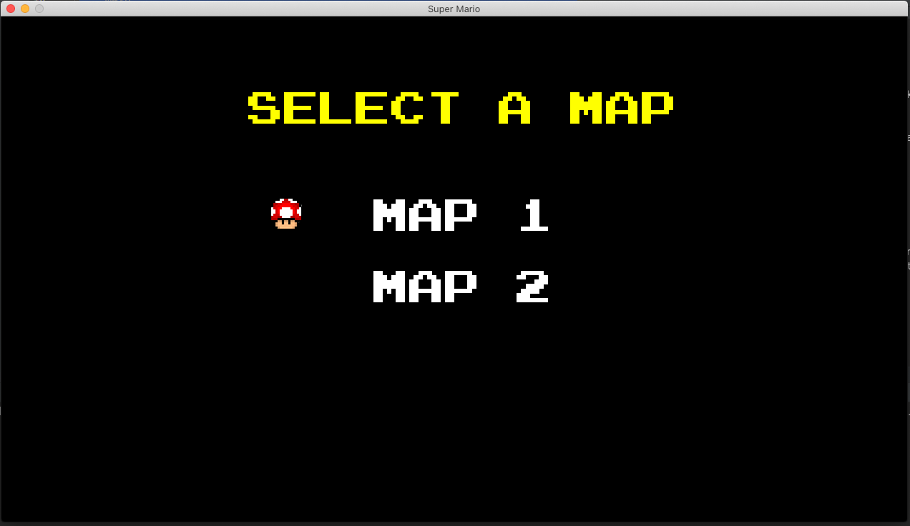
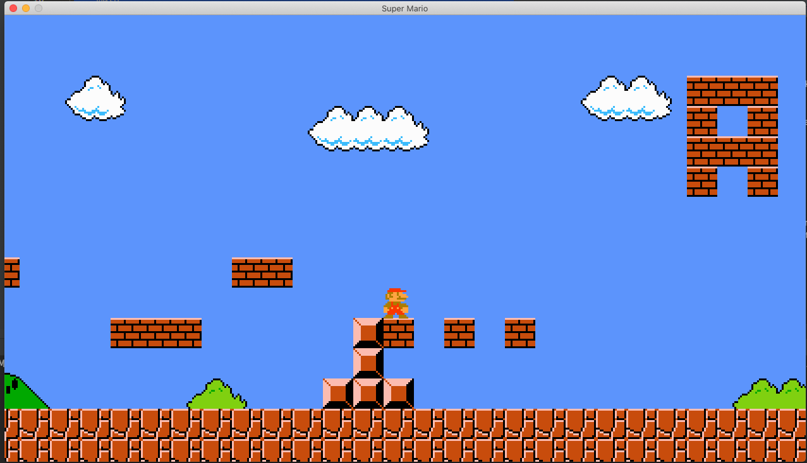

# Mario Game
Java version of Super Mario Game for SUFE final project.

**NOTE: I build this program in OpenJDK 14.0, please use the specific version to run my program successfully.**

# Introduction
This is the repo of my implementation of Super Mario Game with Java as my 
final project. 

## What I have Implemented
- The base UI of Mario Game
- The fundamental operations of Mario Game
- The scroll panel
- Keyboard input management
- Check the collisions of different game items using Dimension and Rectangle

## What I haven't Implemented
- Add BGM to the game
- Add more enemy to the game
- After pass the end point, return to the map selection screen
- Different forms of Mario(Fire Mario, Big Mario e.t.c)
- The surprise bricks that randomly gives some game items

# Project Structure
```
src.com.mario
|
└─── game
│   │   Camera.java # camera move along with mario
│   │   GameAction.java # enum to record the type of keyinput action
│   │   GameHandler.java # mario location update, 
│   │   InputHandler.java # manage the key input
│   │   Map.java # manage map create and map items draw
│   │   MapCreator.java # create map items
│   │
└───main
│   │   Game.java # main class
│   │   Status.java # enum to record the type of game status
│   │
└───object
│   │   Object.java # base class of all the objects in the game
│   │   Brick.java # base class of all the bricks in the game
│   │   GroundBrick.java # bricks of the ground
│   │   OrdinaryBrick.java # ordinary brick
│   │   Mario.java # mario
│   │   MarioForm.java # details of mario
│   │
│   
└───view
│   │   Animation.java # define the animation of object moving
│   │   ImageLoader.java # define the functions to load image
│   │   MapHandler.java # define the views of map
│   │   MapItem.java # define the items of map
│   │   SelectMenu.java # define the views of select menu
│   │   UIHandler.java # manage the view of the game
```

# Screenshots
The following is some screenshots of the game.

## start interface 


## about interface 


## map selection interface


## game running interface


